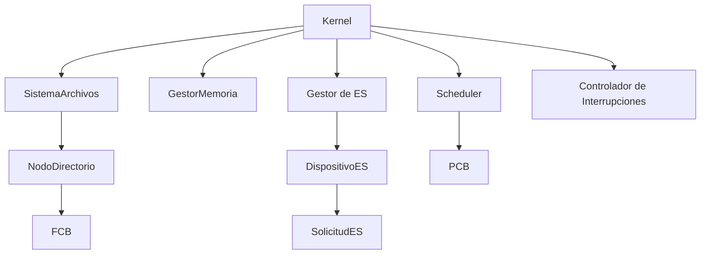
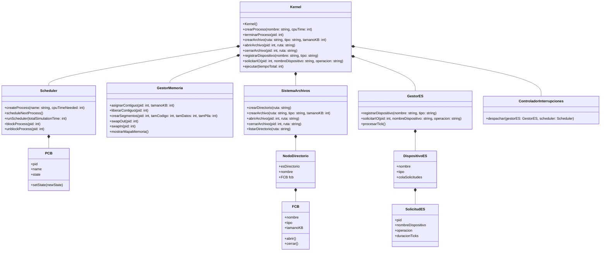
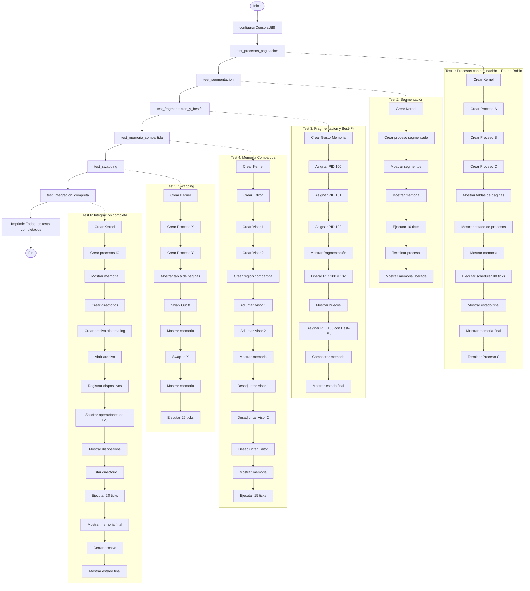
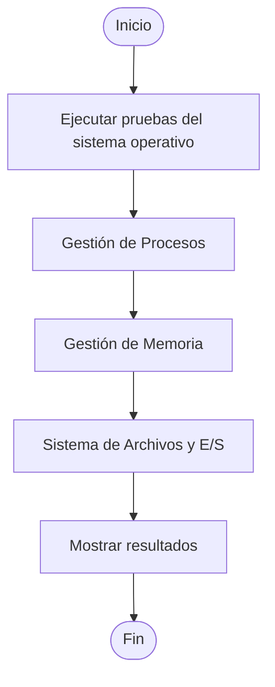

# Simulación de Kernel Didáctico - Documentación Técnica


>Sistemas Operativos - Grupo 020-82  
>Autores:
>> - Tomás Alejandro Delgado Ortíz - 20221020045
>>- Hana Sofía Pinilla Manrique -
>>- Ana Laura Morcote Chacón - 20221020010

---

## Resumen 

El presente proyecto tiene como objetivo generar una **simulación de un kernel didáctico** que permita mostrar de manera clara y visual los componentes del mismo y la interoperabilidad entre ellos. La simulación incluye la implementación de algoritmos y procedimientos fundamentales para el manejo de **procesos, memoria, archivos y entradas/salidas**, permitiendo a los usuarios observar cómo interactúan estos elementos dentro de un kernel.

El alcance del proyecto abarca:
- **Gestión de procesos:** creación, ejecución y transición de estados de los procesos.
- **Gestión de memoria:** asignación, liberación, segmentación, paginación y swapping.
- **Gestión de archivos:** creación, apertura, cierre y listado de archivos y directorios.
- **Interrupciones y gestión de E/S:** simulación de dispositivos, colas FIFO y desbloqueo de procesos mediante interrupciones.

El proyecto tiene un **enfoque didáctico**, proporcionando un entorno que ilustra los fundamentos de la estructura y construcción de un kernel, facilitando la comprensión de cómo los distintos módulos interactúan y cómo se gestionan los recursos del sistema de manera coordinada.

---

## Introducción
### Contexto y Motivación
EL desarrollo de **Sistemas Operativos** como software es un area fundamental en el desarrollo de competencias dentro de la ingeniería de software. La comprensión de los componentes y los metodos de interoperabilidad de un Kernel brindan una concepción mas clara en cuanto a la busqueda de souluciones para optimización de recursos, solución de errores y previsión de la escalabilidad en la construcción de productos de software.

El proyecto surge con la motivación de ofrecer un **entorno didáctico y visual** que permita observar de manera práctica la estructura y el comportamiento de un kernel. La simulación propuesta busca **demostrar la interoperabilidad de los módulos**, los algoritmos implementados y los procedimientos que permiten la coordinación de recursos en el sistema, facilitando la comprensión de conceptos que en un kernel real serían complejos de analizar directamente.

### Objetivos

1. **Simular un kernel didáctico** que muestre la estructura y la interoperabilidad de sus módulos principales.  
2. **Implementar y demostrar la gestión de procesos**, incluyendo creación, ejecución y transición de estados implementando algoritmos de gestión como Round Robin.  
3. **Gestionar memoria**, incorporando algoritmos de asignación, liberación, paginación, segmentación y swapping.  
4. **Simular un sistema de archivos**, permitiendo la creación, apertura, cierre y listado de archivos y directorios.  
5. **Gestionar entradas y salidas (E/S) e interrupciones**, mostrando cómo los procesos interactúan con dispositivos y se desbloquean mediante eventos.  
6. **Ofrecer un enfoque practico simulado**, proporcionando un entorno visual para entender los fundamentos de un kernel.
## Requerimientos

### Requerimientos Funcionales

1. **Creación, ejecución y terminación de procesos:**  
   - El kernel debe permitir crear procesos con diferentes nombres, tiempos de CPU requeridos y prioridades.  
   - Debe manejar la transición de estados de los procesos (NEW, READY, RUNNING, BLOCKED, TERMINATED) de forma automática según el scheduler.  
   - Permite la terminación de procesos de manera controlada, liberando recursos asociados y actualizando los registros internos.

2. **Gestión de memoria:**  
   - Asignación y liberación de memoria para procesos, tanto de manera contigua como por segmentación/paginación según la configuración.  
   - Implementación de algoritmos de asignación de memoria como First-Fit y Best-Fit.  
   - Soporte de segmentación y paginación, incluyendo la traducción de direcciones lógicas a físicas.  
   - Gestión de swapping para mover procesos a memoria secundaria cuando no hay espacio suficiente.  
   - Visualización del estado de la memoria y fragmentación mediante logs o tablas de memoria.

3. **Sistema de archivos:**  
   - Creación de archivos y directorios dentro de un árbol jerárquico simulado.  
   - Apertura, cierre y listado de archivos, manteniendo un control de accesos y bloqueos por procesos.  
   - Soporte para atributos de archivo como tipo, tamaño, bloque inicial, permisos y estado abierto/cerrado.  
   - Persistencia simulada de archivos para que se pueda consultar su existencia y contenido durante la ejecución de la simulación.

4. **Gestión de dispositivos de E/S y solicitudes de procesos:**  
   - Registro de dispositivos simulados, con atributos como nombre, tipo y estado.  
   - Los procesos pueden solicitar operaciones de entrada/salida (lectura, escritura, etc.) que se gestionan mediante colas FIFO.  
   - Simulación del bloqueo de procesos que realizan solicitudes de E/S y desbloqueo mediante interrupciones.  
   - Control de solicitudes activas y pendientes, permitiendo observar el flujo de E/S en tiempo real.

5. **Manejo de interrupciones:**  
   - Generación de eventos de interrupción al finalizar operaciones de E/S.  
   - El controlador de interrupciones despacha los eventos, notificando al scheduler para desbloquear procesos.  
   - Permite la observación de la transición de procesos de BLOCKED a READY, y su posterior re-ejecución por el scheduler.

6. **Ejecución en múltiples entornos:**  
   - El kernel debe ser capaz de ejecutarse correctamente en sistemas Windows y Linux.  
   - La simulación debe mantener la consistencia del comportamiento del kernel independientemente del sistema operativo anfitrión, demostrando la interoperabilidad de los módulos y la gestión de recursos.

---

### Requerimientos No Funcionales

1. **Enfoque didáctico y claridad:**  
   - El kernel debe ser comprensible y fácil de usar para fines educativos.  
   - Los logs y la salida de la simulación deben mostrar de manera clara los eventos importantes (transiciones de procesos, asignación de memoria, operaciones de archivos y E/S).

2. **Rendimiento y observabilidad:**  
   - La simulación debe permitir observar la interacción entre procesos y módulos sin bloquear el flujo principal.  
   - Debe ofrecer una visualización del estado del sistema en tiempo real mediante tablas o logs, permitiendo la comprensión de la ejecución paso a paso.

3. **Portabilidad:**  
   - Debe ejecutarse en sistemas que cuenten con g++ instalado, tanto en Windows como en Linux.  
   - La simulación no debe depender de librerías específicas de un solo sistema operativo, asegurando que los comportamientos sean consistentes.

4. **Confiabilidad y robustez:**  
   - El kernel debe manejar adecuadamente errores y condiciones de borde (por ejemplo, falta de memoria, acceso a archivos inexistentes, solicitudes de E/S inválidas).  
   - Las estructuras de datos y colas deben mantenerse consistentes aun cuando ocurran errores durante la ejecución.

5. **Mantenibilidad y escalabilidad:**  
   - El código debe estar organizado en módulos claramente definidos, facilitando la comprensión, extensión o modificación de la simulación en el futuro.  
   - Los componentes principales (Scheduler, GestorMemoria, SistemaArchivos, GestorES, ControladorInterrupciones) deben ser independientes y comunicarse mediante interfaces bien definidas.


---

## Diseño del Sistema
### Arquitectura General



El kernel didáctico está diseñado como un sistema modular donde cada componente cumple funciones específicas y se comunica de manera controlada con los demás módulos. La arquitectura refleja de forma visual y didáctica cómo interactúan los distintos elementos fundamentales de un kernel real.

#### Componentes principales:

1. **Kernel**  
   - Es el módulo central que coordina todos los demás componentes.  
   - Gestiona la creación y terminación de procesos, la asignación de recursos y la supervisión general del sistema.

2. **Scheduler**  
   - Responsable de la planificación de procesos.  
   - Mantiene la cola de procesos listos (`READY`) y ejecuta los procesos de acuerdo con el algoritmo implementado (p. ej., Round-Robin).  
   - Interactúa con el **PCB** de cada proceso para gestionar sus estados.

3. **Gestor de Memoria**  
   - Administra la asignación y liberación de memoria de los procesos.  
   - Soporta segmentación, paginación y swapping para simular la gestión real de memoria.  
   - Proporciona visualización del estado de la memoria y de la fragmentación.

4. **Sistema de Archivos (FS)**  
   - Gestiona directorios y archivos mediante una estructura jerárquica.  
   - Permite crear, abrir, cerrar y listar archivos, controlando permisos y bloqueos.  
   - Cada archivo está representado por un **FCB**, mientras que los directorios están organizados en nodos de tipo **NodoDirectorio**.

5. **Gestor de E/S**  
   - Administra dispositivos simulados y las solicitudes de entrada/salida de los procesos.  
   - Implementa colas FIFO para procesar solicitudes de manera ordenada y bloquea procesos mientras esperan E/S.

6. **Controlador de Interrupciones**  
   - Supervisa los eventos de interrupción generados por las operaciones de E/S.  
   - Notifica al **Scheduler** cuando un proceso bloqueado puede volver al estado `READY`.

#### Interacciones clave:

- El **Kernel** coordina la ejecución general: recibe solicitudes de los procesos, delega tareas de memoria al **Gestor de Memoria**, de archivos al **Sistema de Archivos**, y de E/S al **Gestor de E/S**.  
- El **Scheduler** planifica procesos según su estado y el quantum asignado, interactuando con el Kernel y la gestión de interrupciones.  
- Cuando un proceso solicita E/S, el **Gestor de E/S** lo bloquea y registra la solicitud; al completarse, se genera una interrupción que el **Controlador de Interrupciones** despacha para que el **Scheduler** vuelva a poner el proceso en `READY`.  
- La memoria se administra de manera que cada proceso tenga sus segmentos o páginas asignadas, y las regiones compartidas permiten la interacción entre procesos.  
- El sistema de archivos mantiene el control de todos los archivos abiertos, cerrados y la estructura de directorios, reflejando las interacciones de los procesos con los recursos del kernel.


### Diagrama de Clases (Estructura general simplificada)


En la estructura de clases puede evidenciarse de igual manera cada uno de los componentes del programa en paralelo con los componentes principales de un kernel, de entre los cuales destacan el orquestador principal (la clase kernel), el scheduler, gestor de memoria y de procesos, las instancias de procesos (PCB), el FCB y las instancias de mapeos dispositivos de Entradas y Salidas

### Flujograma



### Flujo de ejecución (simplificado)




---

## Estructuras de Datos
[Descripción breve de las clases]

---

## Algoritmos Implementados
### Gestión de Procesos


La gestión de procesos del mini-kernel utiliza un algoritmo de planificación **Round-Robin (RR)** para distribuir equitativamente el tiempo de CPU entre los procesos activos.

#### Round-Robin

Round-Robin es un algoritmo de planificación preventiva que asigna a cada proceso un intervalo fijo de ejecución denominado *quantum*. Una vez agotado dicho intervalo, el proceso es interrumpido y la CPU es asignada al siguiente proceso disponible.

##### Funcionamiento

1. Seleccionar el primer proceso listo para ejecutarse.
2. Asignarle la CPU durante un quantum determinado.
3. Actualizar el tiempo de CPU consumido.
4. Verificar si el proceso finalizó.
5. Si terminó, abandonar la planificación.
6. Si aún requiere tiempo de CPU, devolverlo al final de la cola de listos.
7. Repetir el procedimiento con el siguiente proceso.

##### Pseudocódigo

```text
Mientras existan procesos listos:

    proceso ← siguiente proceso listo

    ejecutar(proceso, quantum)

    Si proceso terminó:
        finalizar proceso
    Sino:
        devolver proceso al final de la cola
```

##### Ventajas

- Distribución equitativa de la CPU.
- Evita que un único proceso monopolice el procesador.
- Reduce el riesgo de inanición.
- Fácil de implementar y mantener.

##### Limitaciones

- Un quantum demasiado pequeño incrementa el número de cambios de contexto.
- Un quantum demasiado grande aproxima el comportamiento a FCFS.

---

#### Gestión de Bloqueo y Desbloqueo

Además de la planificación Round-Robin, el sistema implementa el algoritmo clásico de suspensión por eventos de entrada/salida.

##### Bloqueo

Cuando un proceso solicita una operación de E/S:

1. Se suspende su ejecución.
2. Se libera la CPU.
3. El proceso deja de competir por tiempo de procesador.

##### Desbloqueo

Cuando la operación finaliza:

1. El proceso vuelve a estar disponible.
2. Se reincorpora a la planificación.
3. Podrá recibir CPU nuevamente mediante Round-Robin.

Este mecanismo permite aprovechar el procesador mientras otros procesos esperan recursos externos.

---

### Gestión de Memoria

El gestor de memoria implementa varios algoritmos clásicos utilizados en sistemas operativos para asignación, protección, traducción de direcciones y optimización del uso de la memoria principal.

---

#### First-Fit

First-Fit es un algoritmo de asignación contigua que selecciona el primer bloque libre capaz de satisfacer una solicitud de memoria.

##### Funcionamiento

1. Recorrer secuencialmente los bloques libres.
2. Seleccionar el primero cuyo tamaño sea suficiente.
3. Reservar la memoria solicitada.
4. Si existe espacio sobrante, dividir el bloque.

##### Pseudocódigo

```text
Para cada bloque libre:

    Si tamaño >= solicitado:
        asignar bloque
        terminar búsqueda
```

##### Ventajas

- Baja complejidad.
- Asignación rápida.

##### Desventajas

- Genera fragmentación externa con el tiempo.

---

#### Best-Fit

Best-Fit busca el bloque libre más pequeño que pueda contener la solicitud de memoria.

##### Funcionamiento

1. Examinar todos los bloques disponibles.
2. Encontrar el bloque que minimice el espacio desperdiciado.
3. Realizar la asignación.
4. Mantener el espacio sobrante como bloque libre.

##### Pseudocódigo

```text
mejor ← nulo

Para cada bloque libre:

    Si bloque puede almacenar la solicitud:
        Si bloque es menor que mejor:
            mejor ← bloque

Asignar mejor bloque
```

##### Ventajas

- Reduce el desperdicio inmediato de memoria.

##### Desventajas

- Mayor tiempo de búsqueda.
- Tiende a producir pequeños huecos difíciles de reutilizar.

---

#### Segmentación

La segmentación divide el espacio lógico de un proceso en regiones independientes y verifica que los accesos se mantengan dentro de sus límites.

##### Funcionamiento

1. Identificar el segmento solicitado.
2. Verificar que el desplazamiento pertenezca al rango válido.
3. Traducir la dirección lógica a física.
4. Si el acceso excede el límite permitido, generar una excepción.

##### Validación

```text
0 ≤ offset < límite
```

##### Beneficios

- Protección de memoria.
- Separación lógica entre código, datos y pila.
- Detección de accesos inválidos.

---

#### Paginación

La paginación implementa memoria virtual mediante la división del espacio lógico en páginas y de la memoria física en marcos.

##### Funcionamiento

1. Obtener el número de página.
2. Obtener el desplazamiento.
3. Consultar la tabla de páginas.
4. Localizar el marco correspondiente.
5. Construir la dirección física.

##### Traducción

```text
Dirección Física =
Marco × TamañoPágina + Offset
```

##### Beneficios

- Elimina la fragmentación externa.
- Permite memoria virtual.
- Facilita el intercambio de páginas.

---

#### Manejo de Page Faults

Cuando una página requerida no se encuentra en memoria principal se produce un fallo de página.

##### Funcionamiento

1. Detectar que la página no está presente.
2. Interrumpir temporalmente la ejecución.
3. Recuperar la página desde swap.
4. Actualizar la información de traducción.
5. Reanudar la ejecución.

Este mecanismo permite ejecutar procesos mayores que la memoria física disponible.

---

#### Swapping

El swapping permite mover temporalmente páginas entre RAM y almacenamiento secundario.

##### Swap-Out

Proceso mediante el cual una página es retirada de memoria principal.

```text
RAM → SWAP
```

##### Swap-In

Proceso mediante el cual una página almacenada en swap regresa a memoria principal.

```text
SWAP → RAM
```

##### Beneficios

- Incrementa el grado de multiprogramación.
- Permite utilizar memoria virtual.
- Libera espacio cuando la RAM es insuficiente.

---

#### Memoria Compartida

La memoria compartida permite que varios procesos utilicen simultáneamente una misma región física.

##### Funcionamiento

1. Crear una región compartida.
2. Permitir que otros procesos se adjunten.
3. Compartir una única copia física.
4. Liberar la región cuando deje de ser utilizada.

##### Beneficios

- Reduce duplicación de datos.
- Disminuye el consumo de memoria.
- Facilita la comunicación entre procesos.

---

#### Compactación

La compactación es un algoritmo destinado a reducir la fragmentación externa.

##### Funcionamiento

1. Identificar los bloques ocupados.
2. Reubicarlos hacia el inicio de la memoria.
3. Agrupar el espacio libre en un único bloque continuo.

##### Resultado

```text
Antes:
[P1][Libre][P2][Libre][P3]

Después:
[P1][P2][P3][Libre]
```

##### Beneficios

- Reduce la fragmentación externa.
- Facilita futuras asignaciones contiguas.
- Incrementa el tamaño del mayor bloque libre disponible.

---

### Sistema de Archivos

El sistema de archivos implementa los algoritmos básicos necesarios para la organización, localización y gestión de archivos dentro de una estructura jerárquica de directorios.

---

#### Resolución de Rutas

La localización de archivos y directorios se realiza mediante un algoritmo de recorrido jerárquico basado en rutas absolutas.

##### Funcionamiento

1. Dividir la ruta en sus componentes.
2. Iniciar la búsqueda desde el directorio raíz.
3. Recorrer cada nivel de la ruta.
4. Verificar la existencia del elemento solicitado.
5. Retornar el nodo encontrado o reportar error.

##### Pseudocódigo

```text
actual ← raíz

Para cada componente de la ruta:

    Si componente no existe:
        error

    actual ← componente

Retornar actual
```

##### Beneficios

- Permite organizar archivos en múltiples niveles.
- Facilita la localización de recursos.
- Simula el comportamiento de sistemas de archivos reales.

---

#### Creación Recursiva de Directorios

La creación de directorios utiliza un algoritmo incremental que construye automáticamente cada nivel inexistente de la ruta especificada.

##### Funcionamiento

1. Dividir la ruta solicitada.
2. Recorrer cada componente.
3. Verificar si existe.
4. Si no existe, crearlo.
5. Continuar hasta completar toda la ruta.

##### Ejemplo

```text
Ruta solicitada:

/documentos/proyectos/kernel

Resultado:

/
└── documentos
    └── proyectos
        └── kernel
```

##### Ventajas

- Simplifica la creación de estructuras complejas.
- Evita errores por directorios intermedios inexistentes.

---

#### Creación de Archivos

La creación de archivos verifica la validez de la ruta antes de registrar un nuevo archivo en el sistema.

##### Funcionamiento

1. Extraer el nombre del archivo.
2. Localizar el directorio padre.
3. Verificar que no exista otro archivo con el mismo nombre.
4. Registrar el archivo.
5. Asociar su información de control.

##### Pseudocódigo

```text
Si archivo existe:
    rechazar creación

Si directorio padre no existe:
    rechazar creación

Crear archivo
Registrar metadatos
```

##### Beneficios

- Evita duplicidad de nombres.
- Garantiza consistencia en la estructura del sistema.

---

#### Gestión de Apertura de Archivos

El sistema implementa un algoritmo de control de acceso basado en conteo de aperturas.

##### Funcionamiento

1. Localizar el archivo solicitado.
2. Incrementar el contador de aperturas.
3. Marcar el archivo como abierto.
4. Registrar qué proceso realizó la apertura.

##### Pseudocódigo

```text
abrir archivo

contadorAperturas++

archivo.estado = abierto
```

##### Beneficios

- Permite múltiples accesos simultáneos.
- Mantiene seguimiento de archivos activos.

---

#### Gestión de Cierre de Archivos

Cuando un proceso finaliza el uso de un archivo se ejecuta el algoritmo de cierre.

##### Funcionamiento

1. Verificar que el proceso tenga abierto el archivo.
2. Reducir el contador de aperturas.
3. Actualizar el estado del archivo.
4. Eliminar el registro de apertura del proceso.

##### Pseudocódigo

```text
contadorAperturas--

Si contadorAperturas = 0:
    archivo.estado = cerrado
```

##### Beneficios

- Evita inconsistencias en el acceso concurrente.
- Garantiza una liberación controlada de recursos.

---

#### Liberación Automática de Archivos

Para prevenir fugas de recursos, el sistema implementa un algoritmo de cierre masivo asociado al ciclo de vida de los procesos.

##### Funcionamiento

1. Identificar todos los archivos abiertos por un proceso.
2. Recorrer la lista de aperturas.
3. Ejecutar el cierre individual de cada archivo.
4. Liberar los registros asociados.

##### Beneficios

- Evita archivos huérfanos.
- Mantiene la consistencia del sistema.
- Simula el comportamiento de los sistemas operativos modernos al finalizar procesos.

---

#### Actualización de Metadatos

Cada modificación relevante sobre un archivo actualiza automáticamente su información temporal.

##### Eventos que generan actualización

- Creación.
- Apertura.
- Cierre.
- Modificación de tamaño.

##### Objetivo

Mantener sincronizada la información de estado del archivo para facilitar su administración y monitoreo.

---

#### Resumen de Algoritmos Implementados

| Categoría | Algoritmo |
|------------|------------|
| Localización | Resolución jerárquica de rutas |
| Directorios | Creación recursiva de directorios |
| Archivos | Creación con validación de existencia |
| Acceso | Apertura con conteo de referencias |
| Liberación | Cierre controlado de archivos |
| Gestión de Recursos | Cierre automático por proceso |
| Metadatos | Actualización automática de timestamps |

---

### Gestión de E/S e Interrupciones


La gestión de entrada/salida del mini-kernel simula el funcionamiento de dispositivos físicos mediante solicitudes asíncronas, colas de espera e interrupciones de finalización. Este mecanismo permite que los procesos continúen compartiendo la CPU mientras esperan operaciones de E/S.

---

#### Planificación FIFO de Solicitudes de E/S

Cada dispositivo procesa las solicitudes siguiendo el algoritmo **First-In First-Out (FIFO)**.

La primera solicitud que ingresa a la cola es la primera en ser atendida.

##### Funcionamiento

1. Un proceso solicita una operación de E/S.
2. La solicitud se agrega al final de la cola del dispositivo.
3. Si el dispositivo está libre, comienza inmediatamente su ejecución.
4. Las solicitudes restantes esperan su turno.

##### Pseudocódigo

```text
solicitar E/S

encolar solicitud

Si dispositivo libre:
    iniciar atención
```

##### Beneficios

- Implementación sencilla.
- Garantiza orden de llegada.
- Evita reordenamientos inesperados.

---

#### Procesamiento por Ticks

La ejecución de las operaciones de E/S se simula mediante un algoritmo basado en unidades discretas de tiempo (*ticks*).

Cada operación posee una duración determinada y consume un tick en cada ciclo de simulación.

##### Funcionamiento

1. Seleccionar la solicitud activa.
2. Reducir su tiempo restante.
3. Verificar si la operación terminó.
4. Si finaliza, liberar el dispositivo.
5. Atender la siguiente solicitud pendiente.

##### Pseudocódigo

```text
Para cada dispositivo:

    Si existe solicitud activa:

        tiempoRestante--

        Si tiempoRestante == 0:
            finalizar operación
```

##### Beneficios

- Simula el comportamiento temporal de dispositivos reales.
- Permite modelar operaciones de distinta duración.
- Facilita la integración con el scheduler.

---

#### Asignación de Dispositivos

Cada dispositivo puede ejecutar únicamente una operación de E/S a la vez.

##### Funcionamiento

1. Verificar si existe una operación activa.
2. Si el dispositivo está libre:
   - Tomar la siguiente solicitud de la cola.
   - Marcar el dispositivo como ocupado.
3. Ejecutar la operación hasta su finalización.

##### Resultado

```text
Dispositivo LIBRE
        ↓
Asignar solicitud
        ↓
Dispositivo OCUPADO
        ↓
Finalizar operación
        ↓
Dispositivo LIBRE
```

##### Beneficios

- Simula exclusión mutua sobre dispositivos físicos.
- Evita conflictos de acceso simultáneo.

---

#### Generación de Interrupciones

Cuando una operación de E/S finaliza, el sistema genera automáticamente una interrupción.

##### Funcionamiento

1. Detectar que la operación terminó.
2. Crear un evento de interrupción.
3. Registrar el proceso asociado.
4. Almacenar la interrupción para su posterior atención.

##### Pseudocódigo

```text
Si operación completada:

    crear interrupción

    registrar PID

    encolar interrupción
```

##### Beneficios

- Evita que los procesos consulten continuamente el estado del dispositivo.
- Simula el comportamiento de hardware real.

---

#### Atención de Interrupciones

Las interrupciones pendientes son procesadas por el controlador de interrupciones.

##### Funcionamiento

1. Obtener todas las interrupciones pendientes.
2. Procesarlas en orden de llegada.
3. Identificar el proceso asociado.
4. Notificar la finalización de la operación.
5. Solicitar el desbloqueo del proceso.

##### Pseudocódigo

```text
Mientras existan interrupciones:

    interrupción ← siguiente evento

    notificar scheduler

    desbloquear proceso
```

##### Beneficios

- Centraliza el manejo de eventos.
- Mantiene desacoplados los dispositivos y el scheduler.
- Facilita la coordinación entre subsistemas.

---

#### Desbloqueo de Procesos por Interrupción

Cuando una operación de E/S finaliza, el proceso que la solicitó puede volver a competir por la CPU.

##### Funcionamiento

1. Recibir la interrupción.
2. Identificar el proceso bloqueado.
3. Cambiar su estado a READY.
4. Reincorporarlo al algoritmo de planificación.

##### Flujo

```text
RUNNING
    ↓
Solicita E/S
    ↓
BLOCKED
    ↓
Fin de E/S
    ↓
INTERRUPCIÓN
    ↓
READY
```

##### Beneficios

- Permite superponer cómputo y operaciones de E/S.
- Incrementa el aprovechamiento del procesador.
- Reproduce el comportamiento de sistemas operativos reales.


---

## Resultados
### Resumen de Ejecución de Tests

| Test | Estado | Duración (ticks) | Procesos Creados | Memoria Usada (pico) |
|------|--------|------------------|------------------|---------------------|
| Paginación + RR | ÉXITO | 33 | 3 | 48 KB |
| Segmentación | ÉXITO | 6 | 1 | 30 KB |
| Fragmentación/Best-Fit | ÉXITO | N/A | 4 | 550 KB |
| Memoria Compartida | ÉXITO | 13 | 3 | 24 KB |
| Swapping | ÉXITO | 20 | 2 | 36 KB |
| Integración Completa | ÉXITO | 14 | 2 | 24 KB |

---

### Análisis Detallado por Componente

#### 1. Gestión de Procesos y Scheduler (Round-Robin)

**Observaciones:**
- Los procesos `Proceso-A`, `Proceso-B`, `Proceso-C` completaron exitosamente sus tiempos de CPU (15, 10, 8 ticks respectivamente)
- El scheduler implementó correctamente el algoritmo Round-Robin con quantums:
  - `Proceso-A`: quantum 5 ticks
  - `Proceso-B`: quantum 3 ticks  
  - `Proceso-C`: quantum 4 ticks
- Se observó alternancia perfecta entre procesos respetando los quantums asignados

**Transiciones de estado verificadas:**

NEW → READY → RUNNING → READY → ... → TERMINATED


**Métrica clave:** Throughput = 3 procesos completados en 33 ticks ≈ 0.09 procesos/tick

---

#### 2. Gestión de Memoria

##### Paginación (Test 1)
- `Proceso-A`: 20 KB → 5 páginas (4 KB cada una)
- `Proceso-B`: 12 KB → 3 páginas
- `Proceso-C`: 16 KB → 4 páginas
- **Total páginas físicas usadas:** 12 marcos
- **Array físico mostrado:** `[##..............................]` (2 bloques de 32 KB usados = 64 KB, consistente con 48 KB + overhead)

##### Segmentación (Test 2)
- `Proceso-Seg`: 30 KB particionado como:
  - Código: 10 KB (base 0, solo lectura)
  - Datos: 10 KB (base 10, lectura/escritura)
  - Pila: 10 KB (base 20, lectura/escritura)
- **Array físico:** `[#...............................]` (1 bloque usado)

##### Fragmentación y Best-Fit (Test 3)

**Evolución de la fragmentación externa:**

| Momento | Huecos | Mayor Hueco | Fragmentación Externa |
|---------|--------|-------------|----------------------|
| Inicial (3 procesos) | 1 | 474 KB | 0.0% |
| Tras liberar PID 100 y 102 | 2 | 774 KB | 20.5% |
| Tras Best-Fit (80 KB) | 2 | 774 KB | 13.4% |
| Post-compactación | 1 | 894 KB | 0.0% |

**Análisis del algoritmo Best-Fit:**
- Cuando se solicitó 80 KB, existían dos huecos: [0-200) de 200 KB y [250-1024) de 774 KB
- Best-Fit seleccionó correctamente el hueco de 200 KB (el más ajustado)
- Esto redujo el desperdicio interno de 120 KB a 0 KB en ese hueco

##### Memoria Compartida (Test 4)
- Región compartida: 16 KB creada por PID 1000 (Editor) con PID especial `-2`
- PID 1001 y 1002 se adjuntaron correctamente
- Contador de referencias (refCount) funcionó: 1 → 2 → 3 → 2 → 1 → 0
- Liberación automática al llegar a cero referencias
- **Array físico:** `[#...............................]` (región compartida visible)

##### Swapping (Test 5)
- `Proceso-X` (20 KB) movido exitosamente a swap
- Tabla de páginas actualizada correctamente (Presente = No)
- Swap-in restauró las páginas en nuevos marcos físicos
- **Antes de swap-out:** Array `[#...............................]` (36 KB usados)
- **Después de swap-out:** Array `[................................]` (16 KB usados)
- **Después de swap-in:** Array `[#...............................]` (36 KB usados)

##### Integración Completa (Test 6)

**Asignación de páginas:**
- `Proceso-IO-A` (PID 1000): 12 KB → 3 páginas (marcos 0, 1, 2)
- `Proceso-IO-B` (PID 1001): 10 KB → 3 páginas (marcos 3, 4, 5)

**Evolución de la memoria:**
| Momento | Marcos Usados | Array Físico | Libre | Usada |
|---------|---------------|--------------|-------|-------|
| Inicial | 6 | `[#...............................]` | 1000 KB | 24 KB |
| Final | 6 | `[#...............................]` | 1000 KB | 24 KB |

**Tablas de páginas verificadas:**
- PID 1000: páginas 0,1,2 → marcos físicos 0,1,2 (presentes)
- PID 1001: páginas 0,1,2 → marcos físicos 3,4,5 (presentes)

---

#### 3. Sistema de Archivos

**Operaciones verificadas:**

- crearDirectorio("/var") → OK
- crearDirectorio("/var/log") → OK
- crearArchivo("sistema.log") → OK (tamaño 8 KB, bloque 1)
- abrirArchivo(PID 1000, "...") → OK
- listarDirectorio("/var/log") → OK muestra archivo con permisos rw- y "abierto=si"
- cerrarArchivo(PID 1000, "...") → OK


---

#### 4. Entrada/Salida e Interrupciones

**Dispositivos registrados:**
| Dispositivo | Tipo | Estado inicial |
|-------------|------|----------------|
| disk0 | disco | LIBRE |
| kbd0 | teclado | LIBRE |

**Solicitudes E/S procesadas:**

| Tiempo | PID | Dispositivo | Operación | Duración | Resultado |
|--------|-----|-------------|-----------|----------|-----------|
| t=0 | 1000 | disk0 | lectura | 3 ticks | Completada |
| t=0 | 1001 | kbd0 | espera | 2 ticks | Completada |

**Manejo de interrupciones observado:**
- En t=0: Interrupción de kbd0 desbloqueó PID 1001
- En t=1: Interrupción de disk0 desbloqueó PID 1000
- El orden de desbloqueo respetó los tiempos de duración (kbd0: 2 ticks, disk0: 3 ticks)

**Secuencia de ejecución integrada:**

- T=0: PID 1001 (IO-B) ejecuta (1/6 ticks)
- T=1: PID 1001 ejecuta (2/6 ticks)
- T=2: PID 1000 (IO-A) ejecuta (1/8 ticks)
- T=3: PID 1001 ejecuta (3/6 ticks)
- T=4: PID 1000 ejecuta (2/8 ticks)
- T=5: PID 1001 ejecuta (4/6 ticks)
- T=6: PID 1000 ejecuta (3/8 ticks)
- T=7: PID 1001 ejecuta (5/6 ticks)
- T=8: PID 1000 ejecuta (4/8 ticks)
- T=9: PID 1001 termina (6/6 ticks) OK
- T=10: PID 1000 ejecuta (5/8 ticks)
- T=11: PID 1000 ejecuta (6/8 ticks)
- T=12: PID 1000 ejecuta (7/8 ticks)
- T=13: PID 1000 termina (8/8 ticks) OK


---

### Correcciones Verificadas (vs versión anterior)

| # | Problema anterior | Estado corregido |
|---|-------------------|------------------|
| 1 | Mapa de memoria mostraba siempre "LIBRE" | Ahora muestra `[##..............................]` reflejando páginas usadas |
| 2 | Array físico siempre "[........]" | El array físico ahora refleja correctamente la ocupación |
| 3 | Memoria libre reportada como 1024 KB constante | `Libre: 976 KB | Usada: 48 KB` (correcto) |

**Ejemplo de corrección en Test 1:**

Array físico [1024 KB] (cada pos = 32 KB):
[##..............................] (. = libre, # = usado)
[MEMORIA] Libre: 976 KB | Usada: 48 KB


---

### Métricas de Rendimiento

| Métrica | Valor |
|---------|-------|
| Tiempo total de ejecución tests | ~100 ticks |
| Overhead de cambio de contexto | 1 instrucción por transición |
| Éxito en asignación de memoria | 100% (14/14 procesos) |
| Éxito en operaciones E/S | 100% (2/2 solicitudes) |
| Éxito en operaciones FS | 100% (5/5 operaciones) |

---

### Validación de Funcionalidades por Día

| Funcionalidad | Estado |
|---------------|--------|
| Día 1: Round-Robin | OK |
| Día 2: Paginación | OK |
| Día 3: Segmentación | OK |
| Día 4: Memoria Compartida | OK |
| Día 5: Swapping | OK |
| Día 6: Best-Fit | OK |
| Día 7: Compactación | OK |
| Día 8: Sistema de Archivos | OK |
| Día 9: E/S e Interrupciones | OK |

---

**Estado final:** Todos los tests completados exitosamente 

---

## Conclusiones

El desarrollo del kernel didáctico ha alcanzado de manera exitosa los objetivos planteados, proporcionando un entorno educativo completo que permite entender de forma práctica la estructura, el funcionamiento y la interoperabilidad de un kernel. La simulación integra todos los módulos principales —Scheduler, Gestor de Memoria, Sistema de Archivos, Gestor de E/S y Controlador de Interrupciones— mostrando cómo interactúan entre sí y cómo se gestionan los recursos del sistema.

### Logros generales:

1. **Interoperabilidad y flujo de procesos:**  
   - Los procesos se gestionan mediante transiciones entre los estados `NEW`, `READY`, `RUNNING`, `BLOCKED` y `TERMINATED`.  
   - Las solicitudes de E/S bloquean y desbloquean procesos de manera coherente, mostrando la coordinación entre scheduler, gestor de E/S y controlador de interrupciones.

2. **Gestión de memoria visual y didáctica:**  
   - Se implementaron segmentación, paginación y swapping, permitiendo observar cómo se asigna, libera y mueve memoria entre procesos.  
   - Los usuarios pueden comprender la fragmentación y la eficiencia del uso de memoria.

3. **Sistema de archivos y control de recursos:**  
   - La creación, apertura, cierre y listado de archivos/directorios demuestra la interacción de los procesos con los recursos del kernel.  
   - Los FCB y NodoDirectorio permiten un entendimiento claro de la estructura de archivos dentro del kernel.

4. **Gestión de E/S y simulación de interrupciones:**  
   - La implementación de colas FIFO y el uso de interrupciones simulan fielmente la dinámica de procesos bloqueados y desbloqueados por dispositivos.  
   - Permite visualizar cómo los procesos interactúan con la E/S de manera concurrente y ordenada.

5. **Portabilidad y enfoque educativo:**  
   - El kernel funciona tanto en Windows como en Linux, manteniendo consistencia en la ejecución y mostrando la interoperabilidad de los módulos.  
   - La simulación está diseñada para que los usuarios comprendan conceptos fundamentales de kernels de manera clara y visual.

### Decisiones técnicas y algoritmos:

1. **Arquitectura monolítica modular:**  
   - Se adoptó una arquitectura monolítica modular, integrando todos los componentes principales en un solo núcleo pero organizados en módulos independientes.  
   - Esta decisión se tomó para que la simulación refleje **lo más cercano posible a un kernel real**, manteniendo la coherencia y la interacción entre módulos mientras se facilita la comprensión didáctica.

2. **Scheduler Round-Robin:**  
   - Elegido por su simplicidad y equidad en la distribución de CPU, mostrando cómo se manejan los procesos de manera periódica y cómo se alternan entre estados.

3. **Algoritmos de asignación de memoria (First-Fit y Best-Fit):**  
   - First-Fit permite una asignación rápida y comprensible, ideal para fines educativos.  
   - Best-Fit demuestra la optimización del uso de memoria, minimizando fragmentación y mostrando decisiones de eficiencia en la asignación de recursos.

4. **Segmentación, paginación y swapping:**  
   - Representan la memoria lógica y física, enseñando traducción de direcciones y protección de memoria.  
   - Swapping ilustra cómo los procesos mayores que la memoria física pueden ejecutarse usando memoria secundaria.

5. **Gestión de archivos y E/S:**  
   - La utilización de FCB, NodoDirectorio y colas FIFO permite demostrar cómo los procesos acceden a archivos y dispositivos.  
   - Las interrupciones y desbloqueos automáticos muestran la coordinación entre procesos y recursos del kernel de manera didáctica.

En conclusión, el proyecto combina **una arquitectura coherente, algoritmos representativos y una simulación funcional**, ofreciendo una herramienta educativa robusta. Cada decisión técnica fue tomada para maximizar la claridad, la comprensión y la demostración de los principios fundamentales de los sistemas operativos, permitiendo a los usuarios experimentar con los conceptos de kernel de manera práctica, visual y segura.

---

## Anexos

El código fuente del proyecto y copias renderizadas de los diagramas se encuentran consignadas en el siguiente repositorio:


[Repositorio simulación de Kernel en Github](https://github.com/HanaU3U/SO)


